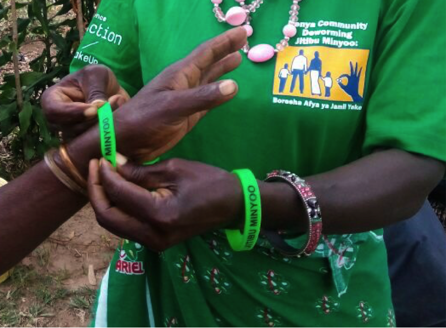

```{r takeup-present-setup, include=FALSE}
library(magrittr)
library(tidyverse)
library(broom)
library(ggrepel)
library(ggmap)
library(ggstance)
library(gridExtra)
library(cowplot)
library(rgeos)
library(sp)
library(rgdal)
library(knitr)
library(modelr)
library(car)
library(rstan)
library(latex2exp)

library(econometr)

source(file.path("..", "rct-design-fieldwork", "takeup_rct_assign_clusters.R"))
source(file.path("..", "analysis_util.R"))
source(file.path("..", "dist_structural_util.R"))

knitr::read_chunk(file.path("..", "analysis_util.R"), labels = "analysis-util")

# knit_hooks$set(document = function(x) {sub('\\usepackage[]{color}', '\\usepackage[table,dvipsnames]{xcolor}', x, fixed = TRUE)})

# read_chunk(purl(file.path("..", "takeup_analysis2.Rmd")))

# read_chunk(purl(file.path("..", "takeup_bayesian_analysis.Rmd")))

options(dplyr.show_progress = FALSE, digits = 4, knitr.kable.NA = '')

knitr::opts_chunk$set(echo = FALSE, cache = TRUE, cache.path = "takeup_beamer-cache/", fig.path = "takeup_beamer-fig/", fig.align = "center")
```

```{r ggplot-theme, cache=FALSE}
theme_set(theme_minimal() +
            theme(legend.position = "bottom",
                  panel.border = element_rect(colour = "darkgrey", fill = NA))) 
```

```{r proj4}
wgs.84 <- "+proj=longlat +datum=WGS84 +no_defs +ellps=WGS84 +towgs84=0,0,0"
kenya.proj4 <- "+proj=utm +zone=36 +south +ellps=clrk80 +units=m +no_defs"
```

```{r load-experiment-design-data}
rct.schools.data <- read_rds(file.path("..", "data", "takeup_rct_schools.rds"))
rct.cluster.selection <- read_rds(file.path("..", "data", "rct_cluster_selection_2.0.rds"))
cluster.strat.data <- read_rds(file.path("..", "data", "takeup_processed_cluster_strat.rds"))

load(file.path("..", "data", "takeup_village_pot_dist.RData"))
```

```{r load-analysis-data}
load(file.path("..", "data", "analysis.RData"))

standardize <- as_mapper(~ (.) / sd(.))
unstandardize <- function(standardized, original) standardized * sd(original)

nosms_data <- analysis.data %>% 
  filter(sms.treatment.2 == "sms.control") %>% 
  left_join(village.centers %>% select(cluster.id, cluster.dist.to.pot = dist.to.pot),
            by = "cluster.id") %>% 
  mutate(standard_cluster.dist.to.pot = standardize(cluster.dist.to.pot)) %>% 
  group_by(cluster.id) %>% 
  mutate(cluster_id = cur_group_id()) %>% 
  ungroup()

monitored_nosms_data <- analysis.data %>% 
  filter(mon_status == "monitored", sms.treatment.2 == "sms.control") %>% 
  left_join(village.centers %>% select(cluster.id, cluster.dist.to.pot = dist.to.pot),
            by = "cluster.id") %>% 
  mutate(standard_cluster.dist.to.pot = standardize(cluster.dist.to.pot)) %>% 
  group_by(cluster.id) %>% 
  mutate(cluster_id = cur_group_id()) %>% 
  ungroup()

analysis_data <- monitored_nosms_data
```

```{r load-fit}
fit_version <- 29

load(file.path("..", "data", "stan_analysis_data", str_interp("dist_fit${fit_version}.RData")))
# load(file.path("..", "data", "stan_analysis_data", str_interp("test3.RData")))

# If using cmdstanr 
dist_fit %<>% 
  map_if(is.character, ~ read_rds(file.path("..", .x)))

if (has_name(dist_fit, "value")) {
  dist_fit_warnings <- dist_fit$warning
  dist_fit %<>% 
    list_modify(!!!.$value, value = NULL, warning = NULL)
}
```

```{r load-beliefs-model-results}
beliefs_results <- read_rds(file.path("..", "data", "stan_analysis_data", "secobeliefs_results.rds")) %>% 
  map(mutate, across(starts_with("assigned.treatment"), fct_relabel, str_to_title)) %>% 
  map(mutate, across(starts_with("assigned.treatment"), fct_relevel, "Bracelet", "Ink", "Calendar", "Control")) 
```

```{r load-processed-dist-fit}
load(file.path("..", "temp-data", str_interp("processed_dist_fit${fit_version}.RData")))

# BUGBUG Handle this is the pre-processing
model_info <- tribble(
  ~ model,                         ~ model_name,                                ~ model_type,
  
  "REDUCED_FORM_NO_RESTRICT",      "Reduced Form",                              "reduced form",
  "STRUCTURAL_LINEAR",             "Structural",                                "structural",
  # "STRUCTURAL_QUADRATIC",          "Structural Quadratic Cost",                 "structural",
  # "STRUCTURAL_QUADRATIC_SALIENCE", "Structural Quadratic Cost With Salience",   "structural",
  "STRUCTURAL_LINEAR_U_SHOCKS",     "Structural",                                "structural",
  
  "STACKED",                        "Stacked Model",                            "combined", # Includes both reduced form and structural models
  "STRUCTURAL_STACKED",             "Structural Stacked Model",                 "structural", 
) %>% 
  mutate(model_type = factor(model_type, levels = c("reduced form", "structural", "combined")))

dist_fit_data %<>% 
  left_join(distinct(., model) %>% 
              mutate(model_color = RColorBrewer::brewer.pal(n(), "Dark2")[1:n()]),
            by = "model") %>% 
  bind_rows(
    filter(., fct_match(model, c("STACKED", "STRUCTURAL_STACKED"))) %>% 
      mutate(fit_type = factor("prior-predict")) %>% 
      mutate_at(vars(starts_with("est_takeup")), map, mutate_at, vars(starts_with("per_"), mean_est), ~ per_0.5) # Add fake prior-predict so plots align/dodge properly
  )

dist_fit_data %<>% 
  select(fit_type, model, model_name, model_type, model_color, starts_with("stacking_weight"), contains("elpd"), starts_with("est"), contains("y_rate_of_change")) %>% 
  mutate_if(~ is.list(.x), map_if, ~ !is_empty(.x), ~ select(.x, -one_of("iter_data")))
```

```{r common-functions}
delta <- function(v, ...) dnorm(v, ...) / ((pnorm(v, ...) * pnorm(v, ..., lower.tail = FALSE)))
```

```{r dist-results, fig.width=7, fig.height=5, dependson="load-processed-dist-fit", eval=FALSE}
group_dist_param %>%
  mutate(distrib_samples = map2(group_dist_mean, group_dist_sd,
                                ~ tibble(x = seq(-500, 3000, 10),
                                         density = dnorm(x, mean = ..1 * ..3, sd = ..2 * ..3)),
                                original_dist_sd = sd(stan_data$analysis_data$cluster.dist.to.pot))) %>%
  ungroup() %>%
  select(iter_id:mix_index, group_dist_mix, distrib_samples) %>%
  pivot_wider(id_cols = c(iter_id, assigned_dist_group), names_from = mix_index, values_from = c(group_dist_mix, distrib_samples)) %>%
  mutate(distrib_samples = map2(distrib_samples_1, distrib_samples_2, inner_join, by = "x", suffix = c("_1", "_2")) %>%
           map2(group_dist_mix_1, ~ mutate(.x, density = .y * density_1 + (1 - .y) * density_2))) %>%
  select(-distrib_samples_1, -distrib_samples_2) %>%
  unnest(distrib_samples) %>%
  ggplot() +
  geom_line(aes(x, density, group = iter_id, color = "Posterior Samples"), alpha = 0.04) +
  geom_freqpoly(aes(x = cluster.dist.to.pot, y = stat(density), color = "Observed Sample Frequency"),
                 binwidth = 200,
                 size = 0.8,
                 data = stan_data$analysis_data %>% distinct(cluster_id, assigned_dist_group = dist.pot.group, cluster.dist.to.pot)) +
  scale_color_manual("", values = c("Posterior Samples" = "black", "Observed Sample Frequency" = "firebrick3")) +
  labs(
    title = "Fit and observed distance to deworming treatment, conditional on assigned distance group (G).",
    x = "Distance",
    y = "",
    caption = "The observed sample distance frequency plot was calculated using bins of width 200 meters.
               Posterior sample distributions are shown using 500 iterations."
  ) +
  coord_cartesian(xlim = c(0, 3000)) +
  theme(axis.text.y = element_blank()) +
  facet_wrap(vars(assigned_dist_group), ncol = 1, labeller = as_labeller(. %>% str_c("G = ", .))) +
  NULL
```

```{r take-up-levels-dist-split, fig.width=7.5, fig.height=5.8, dependson="load-processed-dist-fit", eval=FALSE}
dist_fit_data %>%
  filter(!fct_match(model, "STRUCTURAL_STACKED")) %>% 
  mutate(est_takeup_level = map(est_takeup_level, filter, is.na(mu_assigned_treatment) | mu_assigned_treatment == assigned_treatment)) %>%  
  select(est_takeup_level, model, model_name, fit_type) %>% 
  unnest(est_takeup_level) %>% 
  filter(!is.na(assigned_dist_group)) %>% 
  plot_estimands(assigned_treatment) +
  scale_y_discrete("", labels = str_to_title) +
    labs(
      # title = "Take-up levels in response to an incentive treatment intervention, split by assigned distance group",
      # subtitle = TeX("\\hat{E}\\[Y(z,g)\\]"),
      x = "Take-up Probability") +
  facet_wrap(vars(assigned_dist_group), ncol = 1, labeller = as_labeller(. %>% str_c("G = ", .) %>% TeX(), default = label_parsed)) +
  theme(legend.title = element_blank(), #legend.key.size = unit(0.1, "cm"), legend.box.margin = margin(0, 0, 0, 0, "cm"), 
        plot.caption = element_blank()) +
  guides(color = guide_legend(nrow = 1)) +
  NULL
```

```{r take-up-ate-dist-split, fig.width=7.5, fig.height=5.2, dependson="load-processed-dist-fit", eval=FALSE}
dist_fit_data %>% 
  filter(!fct_match(model, "STRUCTURAL_STACKED")) %>% 
  mutate(est_takeup_te =
    map_if(est_takeup_te, 
           fct_match(model_type, "structural"), filter, mu_assigned_treatment_left == assigned_treatment_left, mu_assigned_treatment_right == assigned_treatment_right) %>% 
    map(filter, 
        !is.na(assigned_dist_group_left) & !is.na(assigned_dist_group_right),
        assigned_dist_group_left == assigned_dist_group_right,
        assigned_treatment_left != assigned_treatment_right,
        fct_match(assigned_treatment_right, c("control", "calendar")))) %>% 
  select(model, model_name, est_takeup_te, fit_type) %>% 
  unnest(est_takeup_te) %>%
  plot_estimands(assigned_treatment_left) +
  scale_y_discrete("", labels = str_to_title) +
    labs(
      # title = "Average treatment effect in response to an incentive treatment intervention", 
      # subtitle = TeX("E\\[Y(z,g)\\] - E\\[Y(z',g)\\]"),
      x = "Average Treatment Effect") +
  facet_grid(rows = vars(assigned_treatment_right), cols = vars(assigned_dist_group_right), 
             labeller = labeller(assigned_treatment_right = as_labeller( . %>% str_c("Compared to, $z' = ", ., "$") %>% TeX(), default = label_parsed),
                                 assigned_dist_group_right = as_labeller(. %>% str_c("G = ", .))), 
             scales = "free_y") +
  theme(legend.key.size = unit(0.4, "cm"), legend.box.margin = margin(0, 0, 0, 0, "cm"), plot.caption = element_blank()) +
  NULL
```

```{r take-up-ate-dist-effect, fig.width=7.5,fig.height=5, dependson="load-processed-dist-fit",eval=FALSE}
dist_fit_data %>% 
  filter(!fct_match(model, "STRUCTURAL_STACKED")) %>% 
  mutate(est_takeup_te =
    map_if(est_takeup_te, 
           fct_match(model_type, "structural"), filter, mu_assigned_treatment_left == assigned_treatment_left, mu_assigned_treatment_right == assigned_treatment_right) %>% 
    map(filter, 
        !is.na(assigned_dist_group_left) & !is.na(assigned_dist_group_right),
        fct_match(assigned_dist_group_left, "far"), fct_match(assigned_dist_group_right, "close"),
        assigned_treatment_left == assigned_treatment_right)) %>% 
  select(model, model_name, est_takeup_te, fit_type) %>% 
  unnest(est_takeup_te) %>%
  plot_estimands(assigned_treatment_left) +
  scale_y_discrete("", labels = str_to_title) +
    labs(
      # title = "Average treatment effect in response to a change in distance", 
      # subtitle = TeX("E\\[Y(z,far)\\] - E\\[Y(z,close)\\]"),
      x = "Average Treatment Effect") +
  theme(plot.caption = element_blank()) +
  NULL
```

```{r take-up-ate-struct-dist-split, fig.width=7.5, fig.height=5.25, dependson="load-processed-dist-fit", eval=FALSE}
dist_fit_data %>% 
  filter(fct_match(model_type, "structural")) %>% 
  select(model, model_name, est_takeup_te, fit_type) %>% 
  unnest(est_takeup_te) %>%
  filter(
    !is.na(assigned_dist_group_left) & !is.na(assigned_dist_group_right),
    assigned_dist_group_left == assigned_dist_group_right,
    fct_match(assigned_treatment_left, "control"), fct_match(assigned_treatment_right, "control"),
    !is.na(mu_assigned_treatment_left),
    !fct_match(mu_assigned_treatment_left, "control"),
    fct_match(mu_assigned_treatment_right, "control"),
  ) %>%
  plot_estimands(mu_assigned_treatment_left) +
  scale_y_discrete("", labels = str_to_title) +
  labs(
    # title = "Average treatment effect of signaling holding consumption utility at the control level,\ncompared to control",
    # subtitle = TeX("\\hat{E}\\[Y(control,g,\\bar{B}(z'))\\] - \\hat{E}\\[Y(control,g)\\]"),
    x = "Average Treatment Effect") +
  facet_wrap(vars(assigned_dist_group_right), ncol = 1, labeller = as_labeller(. %>% str_c("G = ", .) %>% TeX(), default = label_parsed)) +
  theme(plot.caption = element_blank()) +
  NULL
```

```{r cost-mitig-level, fig.width=7.5, fig.height=5.5, dependson="load-processed-dist-fit", eval=FALSE}
treatment_colors <- set_names(RColorBrewer::brewer.pal(4, "Set1"), c("control", "ink", "calendar", "bracelet"))
v_lim <- c(-1, 1)
rate_of_change_data <- dist_fit_data %>% 
  # filter(fct_match(model_type, "structural"), fct_match(fit_type, "fit"), fct_match(model, "STRUCTURAL_STACKED")) %>%  
  filter(fct_match(model_type, "structural"), fct_match(fit_type, "fit"), fct_match(model, "STRUCTURAL_LINEAR")) %>%  
  select(model, model_name, y_rate_of_change, fit_type) %>% 
  unnest(y_rate_of_change) 

takeup_v_plot <- rate_of_change_data %>%  
  unpack(prob_takeup) %>% 
  filter(fct_match(assigned_treatment, "control")) %>% 
  ggplot(aes(v, per_0.5)) +
  geom_line() + 
  coord_cartesian(xlim = v_lim) +
  geom_ribbon(aes(ymin = per_0.1, ymax = per_0.9), alpha = 0.25) +
  labs(subtitle = "Take-up", 
       y = TeX("E\\[Y\\]")) +
       # caption = "Ribbon represents the 80% credible interval.") +
  NULL

social_mult_v_plot <- rate_of_change_data %>%  
  unpack(social_multiplier) %>% 
  ggplot(aes(v, per_0.5, color = assigned_treatment)) +
  geom_hline(yintercept = -1, linetype = "dotted") +
  geom_vline(xintercept = 0, linetype = "dotted") +
  geom_line() + 
  scale_y_continuous(breaks = seq(-2, 0, 0.25)) +
  coord_cartesian(xlim = v_lim) +
  scale_color_manual("Assigned Treatment (z)", values = treatment_colors, labels = str_to_title) +
  labs(subtitle = "Social Multiplier", y = TeX(r"{$-\frac{\partial v^*}{\partial c}$}")) +
  theme(legend.position = "right") +
  NULL

takeup_partial_v_plot <- rate_of_change_data %>%  
  unpack(c(partial_bbar, partial_d), names_sep = "_") %>% 
  select(v, assigned_treatment, starts_with("partial")) %>% 
  pivot_longer(cols = starts_with("partial"), names_to = c("partial", "per"), names_pattern = r"{(partial_[^_]+)_(.+)}") %>% 
  pivot_wider(names_from = per, values_from = value) %>% 
  mutate(partial = str_replace_all(partial, c("partial_bbar" = r"{$\\partial E\\[Y\\]/\\partial c$}",
                                              "partial_d" = r"{$\\partial E\\[Y\\]/\\partial d$}"))) %>%  
  ggplot(aes(v, -per_0.5, color = assigned_treatment)) +
  geom_vline(xintercept = 0, linetype = "dotted") +
  geom_line(show.legend = FALSE) + 
  coord_cartesian(xlim = v_lim) +
  scale_color_manual("Assigned Treatment (z)", values = treatment_colors) +
  labs(subtitle = "Rate-of-change of Take-up", y = "") + # TeX(r"{$\frac{\partial E\[Y\]}{\partial d}$}")) +  
  facet_wrap(vars(partial), scales = "free_y", 
             labeller = as_labeller(TeX, default = label_parsed)) +
  theme(legend.position = "right") +
  NULL

plot_grid(
  
  plot_grid(#takeup_v_plot, 
            social_mult_v_plot + theme(legend.position = "none"), 
            get_legend(social_mult_v_plot), 
            label_fontface = "plain", 
            labels = c("(a)", "")),
  # social_mult_v_plot + theme(legend.position = "none"), 
  
  takeup_partial_v_plot,
 
  labels = c("", "(b)"),
  label_fontface = "plain", 
  # rel_heights = c(0.1, 1, 1),
  ncol = 1
)
```

# Introduction

## Motivation

* According to WHO approx. 2 billion people are infected with soil-transmitted helminths (STH) worldwide.
* Development burden for children and adults in many developing countries. Mild infections often are asymptomatic. More severe infections lead to abdominal pain, iron-deficiency, anemia, malnutrition, and stunting.  

## Motivation 

* Deworming is a public good: 
    - Low private returns for many individuals. 
    - Children are dewormed in schools but remaining reservoir among adult population fosters reinfection. 
    - Most of social benefits come through reduced disease transmission. 
* Cost of screening is 4 to 10 times that of deworming treatment. Deworming drugs are safe, no side effects for uninfected. 

## Motivation

**How can we get adults to take up deworming treatment within a short time and cheap way? **

We can think of other behaviors that have similar public good characteristics, where we observe insufficient take-up and where formal enforcement mechanisms are very costly.

## Contribution

Manipulate the visibility of individuals' actions by introducing social signals in the context of a novel community deworming program: 

* Can we increase adults' willingness to take-up deworming treatment by making (in)actions visible?
* Does visibility in actions affect deworming decisions through social image concerns, or social influence through others? 
* Changing the cost of deworming, how do different marginal types respond (differently) to signals/material incentives, how do changes in average take-up affect deworming decisions/the returns to signaling?
<!-- * (What are the social welfare effects of deworming? What type of people respond to material vs. signaling incentives?)  -->


## Results 

* Social signals significantly increase the demand for deworming treatment.
* Main mechanism is social image concerns. 
<!-- * Deworming take-up of others has no significant effect on individuals’ deworming decision. -->
* Based on our structural model, we do find that signals alter the marginal response to costs and benefits. 

## Outline

1. Theoretical Framework

2. Empirical Context

3. Experiment Design

4. Auxiliary Models
    a) First and Second Order Beliefs
    b) Willingness-to-pay

5. Reduced-Form Model

6. Structural Model

7. Conclusion

<!-- ## Empirical Context: Western Kenya -->

<!-- * Worms are endemic, infection prevalence is over 20%. -->

<!-- * Kenyan Government deworms children for free in schools. School-based deworming is a well-known program. -->

<!-- * Adults can purchase deworming treatment at pharmacies and clinics for 150 KSh. -->

<!-- * Baseline survey -->
<!--     - 78% of adults knew about deworming treatment. -->
<!--     - 68% had taken deworming treatment before. -->
<!--     - 37% reported to have dewormed in the past 12 months. -->
<!--     - 31% of adults had knowledge of externalities. -->

<!-- ## Empirical Context: Western Kenya -->

<!-- * Working with Government of Kenya provided free deworming treatment to approximately 200,000 adults in Busia, Siaya and Kakamega. -->

<!-- * Community Health Volunteers provided deworming at 144 central locations over 12 days, Monday-Sunday 8am-5pm. -->

<!-- * Treatment was offered in two waves from October 3-14 and October 24-November 4 2016. -->

<!-- * Community deworming program first of its kind. -->

<!-- ## Contribution -->

<!-- Manipulate visibility of actions by introducing social signals in an empirically relevant setting: -->

<!-- * Can social signals increase adults’ willingness to contribute to public goods? -->

<!-- * Do social signals affect decisions through social influence (salience/nudges, social learning) from others, or concerns about social image? -->

<!-- * (How do shifts in aggregate demand affect the effectiveness of social signals?) -->

# Theoretical Framework

## Social Signaling

**Social Signaling** [@Benabou2006;@Benabou2012]: Individuals have different _pro-social_ types that are unobservable to others. Others can use your actions to draw inferences about your type.

<!-- \[ U(y_i;v_i,x,\lambda) =  \overbrace{B(y_i;v_i) - C(y_i)}^{\textrm{private returns}} + \overbrace{\mu E_{-i}(v|y_i)}^{\mathclap{\textrm{reputational returns}}} \] -->
\[ U_i(y;v,x,\lambda) =  \overbrace{B_i(y;v) - C_i(y)}^{\textrm{private returns}} + \overbrace{\mu\textrm{E}_{-i}[V\mid y]}^{\mathclap{\textrm{reputational returns}}} \]

* Pro-social activity, $y \in \{0, 1\}$, dewormed or not. 
* Intrinsic motivation, $V \sim F_V$. 
* Signaling visibility and desirability, $\mu$.
* $\textrm{E}_{-i}[V\mid y]$ is the inference that others make about own type $v$ based on your action $y$.

<!-- : health-conscious vs. careless, or good vs. bad citizen -->

## Equilibrium

Equilibrium $v^*$:

\[ B(y=1;v^*) - C(y=1) + \overbrace{\mu \Delta[v^*]}^{\mathclap{\textrm{net reputational incentive}}} = 0 \]

where \[\Delta[v^*] = \expect{V | y =1} - \expect{V|y =0} = \overbrace{\expect{V| V > v^*}}^{\textrm{honor}} - \overbrace{\expect{V| V \leq v^*}}^{\textrm{stigma}}\]

is the difference in the average type based on observed actions.

Without signaling the equilibrium would be $$B(y=1;\tilde{v}) - C(y=1) = 0$$ and thus, with $v^* < \tilde{v}$, signaling induces greater take-up of deworming. 

## Prediction 1

**Prediction 1.** _If it is socially desirable to deworm and individuals care about their reputation (i.e., $\Delta[v^*] > 0$ and $\mu >0$), deworming take-up will be higher when individuals can signal their participation. The greater the visibility of actions, the larger the increase in take-up._

## The Social Multiplier

Let the cost of deworming be $C(y) = yc$, and define the average take-up to be \[\bar{y}(c) = 1 - F_V(v^*(c)),\] the slope of which is 
\[ \bar{y}'(c) = f_V(v^*(c))\cdot\overbrace{\frac{-1}{1 + \mu \Delta'[v^*(c)]}}^{\textrm{social multiplier}} \]
<!-- \[ \frac{d\bar{y}(c)}{dc} = - g(v^*(c)) \frac{dv^*(c)}{dc} = -g(v^*(c))\cdot\overbrace{\frac{1}{1 + \mu \Delta(v^*(c))}}^{\textrm{social multiplier}} \] -->

## The Social Multiplier

\[ -\frac{\textrm{d}v^*(c)}{\textrm{d}c} = \frac{-1}{1 + \mu \Delta'[v^*(c)]} \]

* $\Delta'[v^*] < 0 \implies$ More sensitive to changes in cost/benefits (respectable or normal acts) 
* $\Delta'[v^*] > 0 \implies$ Less sensitive to changes in cost/benefits (admirable or heroic acts) 

```{r, message=FALSE, fig.width=7.5, fig.height=3}
delta_data <- tibble(v = seq(-25, 25, 0.1), delta = delta(v)) 

delta_data %>% 
  filter(abs(v) <= 1) %>% 
  ggplot() +
  geom_smooth(aes(v, delta), color = "darkgrey") +
  geom_smooth(aes(v, delta * 1.1), color = alpha("darkgrey", 0.25)) +
  geom_smooth(aes(v, delta * 1.2), color = alpha("darkgrey", 0.25)) +
  geom_smooth(aes(v, delta * 0.9), color = alpha("darkgrey", 0.25)) +
  geom_smooth(aes(v, delta * 0.8), color = alpha("darkgrey", 0.25)) +
  geom_text(aes(x, y, label = t), 
            data = tibble(x = c(-0.75, 0, 0.75), y = c(1.85, 1.65, 1.85), t = c("Respectable Acts", "Modal Acts", "Admirable Acts"))) +
  labs(x = latex2exp::TeX("v^*$"), y = latex2exp::TeX(r"{$\Delta\[v^*\]$}")) +
  theme_minimal() +
  theme(axis.text = element_blank(), panel.grid = element_blank(), axis.line = element_line())
```

## Prediction 2

**Prediction 2.** _Greater observability of action ($\mu > 0$) would lead to:_

  a) _lesser sensitivity to costs when take-up is low (deworming is an admirable act)_
  b) _greater sensitivity to costs when take-up is high (deworming is a respectable act)_ 
<!-- **Prediction 2.** _Changes in the cost of deworming lead to increases (decreases) in reputational returns, increasing (decreasing) the effect of signals and the share of individuals taking up deworming treatment._  -->

* If the cost to deworming is high, because of distance, would signaling mitigate the drop in take-up?
* If the cost to deworming is low, and take-up is a norm, would signaling amplify the effect of other incentives?

<!-- ## Alternative Mechanisms -->

<!-- 1. Signals have a private consumption value. -->
<!-- 2. Salience and social learning. -->

# Empirical Context

## Western Kenya

* Worms are endemic, infection prevalence is over 20%.
* Kenyan Government deworms children for free in schools. School-based deworming is a well-known program.
* Adults can purchase deworming treatment at pharmacies and clinics for 150 KSh.

* Baseline survey
    - 78% of adults knew about deworming treatment.
    - 68% had taken deworming treatment before.
    - 37% reported to have dewormed in the past 12 months.
    - 31% of adults had knowledge of externalities.
    
## Reported Social Value

```{r praise-stigma-plot, fig.width=8, fig.height=3}
baseline.data %>% 
  select(matches("^(praise|stigma)_[^_]+$")) %>% 
  gather(key = key, value = response) %>% 
  separate(key, c("praise.stigma", "topic"), "_") %>% 
  separate(topic, c("topic", "question.group"), -2) %>% 
  filter(!is.na(response)) %>% 
  count(praise.stigma, topic, response) %>% 
  group_by(praise.stigma, topic) %>% 
  mutate(n = n/sum(n)) %>% 
  ungroup %>%
  mutate_at(vars(praise.stigma, response), ~ fct_relabel(factor(.), str_to_title)) %>% 
  mutate(topic = fct_recode(factor(topic), 
                            "Wearing/not wearing nice clothes to church" = "clothe",
                            "Use Latrine/open defecation" = "defecat",
                            "Deworming/not deworming during MDA" = "dewor",
                            "Immunize/not immunize children" = "immuniz")) %>% 
  ggplot(aes(response)) +
  geom_col(aes(y = n), alpha = 0.5) +
  labs(y = "Proportion", x = "") +
  scale_y_continuous(breaks = seq(0.25, 1, 0.25)) +
  coord_flip() +
  facet_grid(topic ~ praise.stigma, labeller = label_wrap_gen(width = 20)) +
  theme_bw() +
  theme(legend.position = "bottom",
      strip.text.y = element_text(angle = 0), 
      strip.background = element_rect(colour = NA), 
      panel.border = element_blank()) 
```

## Community-based Deworming Program

* We worked with the government of Kenya and its county governments, providing free deworming treatment to approximately 200,000 adults in Busia, Siaya and Kakamega. 
* Community Health Volunteers (CHVs) provided deworming at 144 central locations over 12 days, Monday-Sunday 8am-5pm. 
* CHVs informed communities prior to deworming about the social benefits of deworming, the dates and location.  
<!-- * Community deworming program first of its kind.  -->

# Experimental Design

## Interventions 

Two primary interventions:

1. _Incentive_: incentivizing deworming take-up using.
    a) _Control_: no incentives.
    b) _Calendars_: a private incentive with low visibility.
    c) _Bracelets_: a social signal with some potential private valuation.
    d) _Indelible Ink_: a social signal with no private valuation.
    
    $Z \in \{\textrm{control, calendar, bracelet, ink}\}$
    
2. _Cost to Deworm_: manipulating cost by randomly varying the distance to deworming location.

    $G \in \{\textrm{close, far}\}$
    
## Experiment Diagram


## Site Selection

```{r all-clusters-map, message=FALSE, warning=FALSE, fig.width=3.8}
ggplot.clusters(rct.cluster.selection, include.cluster.ids = FALSE, suppress.selected.clusters = FALSE, 
                source = "stamen", maptype = "toner") +
  theme(legend.position = "none", axis.text = element_blank())
```

## Site Selection

```{r, message=FALSE, warning=FALSE, fig.width=3.8}
ggplot.clusters(rct.cluster.selection, include.cluster.ids = FALSE, suppress.selected.clusters = TRUE, 
                source = "stamen", maptype = "toner") +
  theme(axis.text = element_blank())
```
    
## Social Signals

We introduce two signals for individuals to show they came for deworming treatment: (1) green bracelet and (2) indelible green ink.

{height=58%}

Bracelet saying "Treat worms: improve the health of your community"

## Private Incentive 
We introduce a (private) material reward, in form of a 2017 one-page calendar. We assume that the consumption value of the calendar is equal to that of the bracelet.

{height=65%}

## Random Distance to Treatment Location 

```{r act-dist, fig.width=8, fig.height=6}
analysis.data %>%  
  mutate(assigned.treatment = fct_relabel(assigned.treatment, str_to_title)) %>% 
  ggplot(aes(dist.to.pot)) +
  geom_density(aes(color = dist.pot.group, linetype = "Household")) +
  geom_density(aes(color = dist.pot.group, linetype = "Cluster Center"),
               data = mutate(village.centers, assigned.treatment = fct_relabel(assigned.treatment, str_to_title))) +
  geom_vline(xintercept = c(1250), linetype = "dashed") +
  labs(y = "Density", 
       caption = "Cluster centers were calculated as the centroid location of all households in cluster.") +
  scale_x_continuous("Distance to Treatment Location (meters)", breaks = seq(0, 10000, 2500/4)) +
  scale_color_discrete("Cluster Distance Assignment", labels = c("Close", "Far")) +
  scale_linetype_discrete("Distance From") +
  facet_wrap(~ assigned.treatment) +
  theme_minimal() +
  theme(legend.position = "bottom") 
```


# Auxiliary Models 

## First and Second Order Beliefs

* In the endline household survey, respondents were asked some questions about 10 random members of their community.
* Among these questions, they were asked:
    - Whether they knew the person.
    - Whether they know if the other person got dewormed.
    - Whether the other person knew if the respondent got dewormed.
* We want to identify how the signaling treatments affect:
    a) Perception of the observability of others' actions (first order)
    b) Perception of the observability of their own actions (second order)
    

## First and Second Order Beliefs

* $Z_i \in \{\textrm{control, ink, calendar, bracelet}\}$, $i$'s assigned incentive treatment.
* $Y_i^{\textrm{rec}} \in \{0,\ldots,10\}$, number of recognized peers.
* $Y_i^{\textrm{1ord}}$, number of recognized peers that $i$ has knowledge of whether they got dewormed or not, 
  \begin{align*}
    Y_i^{\textrm{1ord}} &\sim \mathtt{Binomial}(Y_i^{\textrm{rec}}, p_i^{\textrm{1ord}}) \\
    p_i^{\textrm{1ord}} &= \mathsf{logit}^{-1}(\alpha_i + \beta_i^{\textrm{1ord}}\cdot z).
  \end{align*}
* $Y_i^{\textrm{2ord}}$, number of recognized peers who have knowledge of $i$'s deworming choice, 
  \begin{align*}
    Y_i^{\textrm{2ord}} &\sim \mathtt{Binomial}(Y_i^{\textrm{rec}}, p_i^{\textrm{2ord}}) \\
    p_i^{\textrm{2ord}} &= \mathsf{logit}^{-1}(\alpha_i + \beta_i^{\textrm{2ord}}\cdot z).
  \end{align*}
  
## First and Second Order Beliefs

```{r, fig.height=5.0, fig.width=7.5}
cowplot::plot_grid(
  beliefs_results$prob_knows %>% 
    filter(ord == 1) %>% 
    ggplot(aes(y = assigned.treatment)) +
    geom_linerange(aes(xmin = per_0.05, xmax = per_0.95), size = 0.4) +
    geom_crossbar(aes(x = per_0.5, xmin = per_0.1, xmax = per_0.9), fatten = 2, size = 0.4, width = 0.2) +
    geom_linerange(aes(xmin = per_0.25, xmax = per_0.75), alpha = 0.4, size = 2.5) +
    geom_point(aes(x = per_0.5), size = 1.8) +
    geom_point(aes(x = per_0.5), color = "white", size = 0.6) +
    labs(
      title = "First Order Beliefs",
      subtitle = "Proportion",
      x = "", y = "") +
    NULL,
  
  beliefs_results$ate_knows %>% 
    filter(ord == 1) %>% 
    ggplot(aes(y = assigned.treatment_left)) +
    geom_vline(xintercept = 0, linetype = "dotted") +
    geom_linerange(aes(xmin = per_0.05, xmax = per_0.95), size = 0.3) +
    geom_crossbar(aes(x = per_0.5, xmin = per_0.1, xmax = per_0.9), fatten = 2, size = 0.4, width = 0.2) +
    geom_linerange(aes(xmin = per_0.25, xmax = per_0.75), alpha = 0.4, size = 2.25) +
    geom_point(aes(x = per_0.5), size = 1.8) +
    geom_point(aes(x = per_0.5), color = "white", size = 0.6) +
    scale_y_discrete(drop = FALSE) +
    labs(
      title = "",
      subtitle = "Treatment Effect",
      x = "", y = "") +
    theme(axis.text.y = element_blank()) +
    NULL,
  
  beliefs_results$prob_knows %>% 
    filter(ord == 2) %>% 
    ggplot(aes(y = assigned.treatment)) +
    geom_linerange(aes(xmin = per_0.05, xmax = per_0.95), size = 0.4) +
    geom_crossbar(aes(x = per_0.5, xmin = per_0.1, xmax = per_0.9), fatten = 2, size = 0.4, width = 0.2) +
    geom_linerange(aes(xmin = per_0.25, xmax = per_0.75), alpha = 0.4, size = 2.5) +
    geom_point(aes(x = per_0.5), size = 1.8) +
    geom_point(aes(x = per_0.5), color = "white", size = 0.6) +
    labs(
      title = "Second Order Beliefs",
      subtitle = "Proportion",
      x = "", y = "") +
    NULL,
  
  beliefs_results$ate_knows %>% 
    filter(ord == 2) %>% 
    ggplot(aes(y = assigned.treatment_left)) +
    geom_vline(xintercept = 0, linetype = "dotted") +
    geom_linerange(aes(xmin = per_0.05, xmax = per_0.95), size = 0.3) +
    geom_crossbar(aes(x = per_0.5, xmin = per_0.1, xmax = per_0.9), fatten = 2, size = 0.4, width = 0.2) +
    geom_linerange(aes(xmin = per_0.25, xmax = per_0.75), alpha = 0.4, size = 2.25) +
    geom_point(aes(x = per_0.5), size = 1.8) +
    geom_point(aes(x = per_0.5), color = "white", size = 0.6) +
    scale_y_discrete(drop = FALSE) +
    labs(
      title = "",
      subtitle = "Treatment Effect",
      x = "", y = "",
      caption = "Line range: 90% credible interval. Outer box: 80% credible interval. Inner box: 50% credible interval. Point: median."
    ) +
    theme(axis.text.y = element_blank()) +
    NULL,
  
  ncol = 2, axis = "b", align = "h" 
)
```

## Wilingness-to-pay Experiment

1. Subjects (from the control arm) were asked to choose one of two gifts, a calendar or a bracelet (2% wanted neither).
2. Subjects were offered payment in order to switch to the gift not selected. Offer was randomly chosen from ${0, 10,\ldots,100}$ KSh.

## Wilingness-to-pay Experiment

* $G_i \in \{-1, 1\}$ indicates initial gift choice.
* $M_i \in \{0, 10, 20,\ldots, 100\}$ be the randomly assigned offer (in KSh).
* $W_i(m) \in \{0, 1\}$ indicates acceptance of $m$ KSh offer. 

\begin{align*}
  \text{Difference in valuation,}~V_i &\sim \mathtt{Normal}(\mu_{k[i]}, \sigma) \\
  \text{Strata mean difference,}~\mu_k &\sim \mathtt{Normal}(\mu, \tau_\mu) \\
  \mu &\sim \mathtt{Normal}(0, 200) \\
  \sigma &\sim \mathtt{Normal^{+}}(0, 100) \\
  \tau_\mu &\sim \mathtt{Normal^+}(0, 100)
\end{align*}
\begin{equation*}
\mathcal{L}_i = 
  \begin{cases}
    \prob{V < -m_i} & w_i = 0 \land g_i = -1 \\ 
    \prob{V > m_i} & w_i = 0 \land g_i = 1 \\ 
    g_i(\prob{V < g_i \cdot m_i} - \prob{V < 0}) & w_i = 1
  \end{cases}
\end{equation*}

## Willingness-to-Pay

```{r load-wtp-fit}
wtp_model_0_fit <- read_rds(file.path("..", "data", "stanfit", "wtp_model_fit.rds"))
```

```{r wtp-prefer-calendar-plot, fig.height=5.0, fig.width=7, dependson="load-wtp-fit"}
wtp_model_0_fit$draws(c("prob_prefer_calendar", "strata_mu")) %>% 
  posterior::as_draws_df() %>% 
  mutate(iter_id = seq(n())) %>% 
  pivot_longer(-iter_id, names_to = "parameter", values_to = "iter_value") %>% 
  tidyr::extract(parameter, c("parameter", "index"), r"{([^\[]+)(?:\[(\d+)\])?}", convert = TRUE) %>% 
  group_by(parameter, index) %>% 
  summarize(
    per = c(0.05, 0.1, 0.25, 0.5, 0.75, 0.9, 0.95),
    quant = quantile(iter_value, probs = per),
    mean_est = mean(iter_value),
    
    .groups = "drop"
  ) %>% 
  pivot_wider(names_from = per, values_from = quant, names_prefix = "per_") %>% { 
    cowplot::plot_grid(
      filter(., fct_match(parameter, "prob_prefer_calendar")) %>% 
        left_join(tibble(index = 1:21, val_diff = -seq(-100, 100, 10)), by = "index") %>% 
        ggplot(aes(x = val_diff)) +
        geom_line(aes(y = per_0.5)) +
        geom_point(aes(y = per_0.5), size = 1) +
        geom_ribbon(aes(ymin = per_0.1, ymax = per_0.9), alpha = 0.4) +
        scale_x_continuous("Added Value [KSh]", breaks = seq(-100, 100, 10)) + #, labels = scales::label_number(suffix = " KSh")) +
        labs(
          title = "Probability of Preference for Calendars vs. Bracelets",
          y = "" 
        ) +
        # coord_cartesian(ylim = c(-1, 1)) +
        NULL,
      
      filter(., fct_match(parameter, "strata_mu")) %>% 
        mutate(across(c(starts_with("per_"), mean_est), multiply_by, 100)) %>% 
        ggplot(aes(y = str_c(parameter, index))) +
        geom_linerange(aes(xmin = per_0.25, xmax = per_0.75), alpha = 0.4, size = 3) +
        geom_crossbar(aes(x = per_0.5, xmin = per_0.1, xmax = per_0.9), fatten = 2, size = 0.4, width = 0.2) +
        geom_linerange(aes(xmin = per_0.05, xmax = per_0.95), size = 0.4) +
        geom_point(aes(x = mean_est), size = 2) +
        geom_point(aes(x = mean_est), color = "white", size = 0.8) +
        scale_x_continuous("", labels = scales::label_number(suffix = " KSh")) +
        theme(axis.text.y = element_blank()) +
        labs(
          title = "Difference in Valuation of Calendars and Bracelets",
          subtitle = "For Each County",
          y = "",
          caption = "Line range: 90% credible interval. Outer box: 80% credible interval. Inner box: 50% credible interval. 
                     Thick vertical line: median. Point: mean."
        ),
      
      ncol = 1, rel_heights = c(1.1, 1)
    )
  }
```

# Reduced-Form Model

## Model Specification

We estimate our reduced-form estimands as 

\begin{align*}
E[Y_i(z) | G_i = g] &= P[Y_i = 1 | Z_i = z, G_i = g] \\
                &= \Phi\left(\beta_z + \beta_g + \beta_{zg}\right).
\end{align*}
                <!-- &= \Phi\left(\beta_{0,j[i]} + \boldsymbol{\beta}_{1,j[i]}(z) + \boldsymbol{\beta}_{2,j[i]}(g) + \boldsymbol{\beta}_{3,j[i]}(z,g)\right). -->

We use a hierarchical Bayesian model to compute the posterior mean of our estimand. This allows us to model heterogeneity over villages and counties (experiment strata).

## Reduced-form Estimands

 Incentive/signal average treatment effect: 
    \begin{align*}
      \expect{Y(\textrm{bracelet})} &- \expect{Y(\textrm{control})}  \\
      \expect{Y(\textrm{ink})} &- \expect{Y(\textrm{control})}  \\
      \expect{Y(\textrm{calendar})} &- \expect{Y(\textrm{control})} \\
      \expect{Y(\textrm{bracelet})} &- \expect{Y(\textrm{calendar})} 
    \end{align*}
<!-- * Conditional on assigned distance, $g$: -->
<!--     \begin{align*} -->
<!--       \expect{Y(\textrm{bracelet}) | G = g} &- \expect{Y(\textrm{control}) | G = g}  \\ -->
<!--       \expect{Y(\textrm{ink}) | G = g} &- \expect{Y(\textrm{control}) | G = g}  \\ -->
<!--       \expect{Y(\textrm{calendar}) | G = g} &- \expect{Y(\textrm{control}) | G = g} \\ -->
<!--       \expect{Y(\textrm{bracelet}) | G = g} &- \expect{Y(\textrm{calendar}) | G = g}  -->
<!--     \end{align*} -->
    
## Reduced-Form Take-up Levels

```{r reduced-form-take-up-levels, fig.width=5.5,fig.height=1.75,cache=FALSE, dependson="load-processed-dist-fit"}
dist_fit_data %>%
  filter(fct_match(model, "REDUCED_FORM_NO_RESTRICT")) %>% 
  mutate(est_takeup_level = map(est_takeup_level, filter, is.na(mu_assigned_treatment) | mu_assigned_treatment == assigned_treatment)) %>% 
  select(est_takeup_level, model, model_name, fit_type) %>% 
  unnest(est_takeup_level) %>% 
  filter(is.na(assigned_dist_group)) %>% 
  plot_estimands(assigned_treatment) +
  scale_y_discrete("", labels = str_to_title) +
  labs(
    # title = "Take-up levels in response to an incentive treatment intervention",
    # subtitle = TeX("\\hat{E}\\[Y(z)\\]"),
    x = "Take-up Probability") +
  theme(legend.position = "none") +
  NULL
```
## Reduced-Form Average Treatment Effects

```{r reduced-form-take-up-ate, fig.width=5.5,fig.height=2.5,cache=FALSE, dependson="load-processed-dist-fit"}
dist_fit_data %>% 
  filter(fct_match(model, "REDUCED_FORM_NO_RESTRICT")) %>% 
  mutate(est_takeup_te =
    map_if(est_takeup_te, 
           fct_match(model_type, "structural"), filter, mu_assigned_treatment_left == assigned_treatment_left, mu_assigned_treatment_right == assigned_treatment_right) %>% 
    map(filter, 
        is.na(assigned_dist_group_left) & is.na(assigned_dist_group_right),
        assigned_treatment_left != assigned_treatment_right,
        fct_match(assigned_treatment_right, c("control", "calendar")),
        fct_match(assigned_treatment_left, "bracelet") | !fct_match(assigned_treatment_right, "calendar"))) %>% 
  select(model, model_name, est_takeup_te, fit_type) %>% 
  unnest(est_takeup_te) %>%
  mutate_at(vars(starts_with("assigned_dist_group")), fct_explicit_na, "Combined") %>% 
  plot_estimands(assigned_treatment_left) +
  scale_y_discrete("", labels = str_to_title) +
  labs(
    x = "") +
  ggforce::facet_col(vars(assigned_treatment_right), 
             labeller = as_labeller(. %>% str_c("Compared to, $z' = ", ., "$") %>% TeX(), default = label_parsed), 
             space = "free",
             scales = "free_y") +
  theme(legend.position = "none") +
  NULL
```
## Reduced-Form Take-up Levels, Conditional on Distance

```{r reduced-form-take-up-levels-dist-split, fig.width=5.5, fig.height=3.0, dependson="load-processed-dist-fit"}
dist_fit_data %>%
  filter(fct_match(model, "REDUCED_FORM_NO_RESTRICT")) %>% 
  mutate(est_takeup_level = map(est_takeup_level, filter, is.na(mu_assigned_treatment) | mu_assigned_treatment == assigned_treatment)) %>%  
  select(est_takeup_level, model, model_name, fit_type) %>% 
  unnest(est_takeup_level) %>% 
  filter(!is.na(assigned_dist_group)) %>% 
  plot_estimands(assigned_treatment) +
  scale_y_discrete("", labels = str_to_title) +
    labs(
      # title = "Take-up levels in response to an incentive treatment intervention, split by assigned distance group",
      # subtitle = TeX("\\hat{E}\\[Y(z,g)\\]"),
      x = "Take-up Probability") +
  facet_wrap(vars(assigned_dist_group), ncol = 1, labeller = as_labeller(. %>% str_c("G = ", .) %>% TeX(), default = label_parsed)) +
  theme(legend.position = "none") +
  NULL
```
    
# Structural Model

## Why a Structural Model?

* We want to estimate the causal effect of signals on the social multiplier, or rather on \[ \frac{\partial \expect{Y(z, v^*)}}{\partial d} = f(v^*)\cdot\frac{-\delta}{1 + \mu_z\Delta'[v^*]}~~, \] _holding $v^*$ fixed for both counterfactuals._ For this we need to fit the cutoffs $v^*(z,d)$ to the data and to identify the parameters $\mu_z$. 
* The reduced-form estimate of the signaling effect, by comparing to the calendar arm, potentially confounds social signaling with social learning, salience, etc. 
    
## Structural Causal Model DAG

Deworming take-up is determined by 
\begin{align*}
  Y_i(z,d) &= \mathbbm{1}\{\overbrace{B_i(y=1;v_i,z) - C_i(y=1;d)}^{B} + \overbrace{\mu\Delta[v^*(z,d)] + u_{ir}}^{R} + u_{iy} > 0\} \\
           &= \mathbbm{1}\{\overline{B}(z,d)  + \mu\Delta[v^*(z,d)] + u_{ib} + u_{ir} + u_{iy} > 0\}
\end{align*}

The causal relationships between our model's variables are 
\begin{figure}
\centering
\begin{tikzpicture}
  [
    node distance=2cm,
    line width=1,
    every label/.append style={font=\Large},
    observed/.style={circle,fill=black,inner sep=0pt,minimum size=2mm},
    latent/.style={circle,draw=black,inner sep=0pt,minimum size=2mm},
    latent-edge/.style={->,dashed},
  ]

\node[observed,visible on=<6->] (Y) [label=above:$Y$] {};
\node[latent,visible on=<5->] (B) [label=below:$B$,below=of Y] {}
  edge[->,visible on=<6->] (Y);
\node[latent,visible on=<4->] (R) [label=above:$R$,left=of Y] {}
  edge[->,visible on=<6->] (Y);
\node[latent,visible on=<3->] (Bbar) [label=below:$\overline{B}$,left=of B] {}
  edge[->,visible on=<5->] (B)
  edge[->,visible on=<4->] (R);
\node[observed] (Z) [label=left:$Z$,left=of R] {}
  edge[->,visible on=<4->] (R)
  edge[->,visible on=<3->] (Bbar);
\node[observed,visible on=<2->] (D) [label=below:$D$,left=of Bbar] {}
  edge[->,visible on=<3->] (Bbar);
\node[observed] (G) [label=left:$G$,left=of D] {}
  edge[->,visible on=<2->] (D);
\node[latent,visible on=<7->] (U) [label=right:$U$,right=of Y] {}
  edge[latent-edge,->,visible on=<7->] (B)
  edge[latent-edge,->,bend right=45,visible on=<7->] (R)
  edge[latent-edge,->,visible on=<7->] (Y);
\end{tikzpicture}
\end{figure}


<!-- ## Structural Causal Model Functions -->
<!-- Since we manipulate observability, define \[\mu_z = x_z\lambda.\] -->
<!-- This is how the variables in our model are determined -->
<!--   <!-- \bar{b} &\leftarrow f_{\overline{B}}(z, d) = \beta_{z} - (d\cdot\delta_1 + d^2\cdot\delta_2) \\ --> 
<!-- \begin{align*}  -->
<!--   \bar{b} &\leftarrow f_{\overline{B}}(z, d) = \beta_{z} - d\cdot\delta \\ -->
<!--   b &\leftarrow f_B(\bar{b}; v, u_b) = \bar{b} + v + u_b \\ -->
<!--   r &\leftarrow f_R(z,\bar{b}; u_r) = \mu_z\cdot\Delta[v^*(z,\bar{b})] + u_r \\ -->
<!--   y &\leftarrow f_Y(b,r;u_y) = \mathbbm{1}(b + r + u_y > 0), -->
<!-- \end{align*} -->
<!-- and the equilibrium $v^*(z,\bar{b})$ is defined as  -->
<!-- \begin{align*} -->
<!-- v^*(z,\bar{b}) + \bar{b} + \mu_z \overbrace{\left(\expect{V | V > v^*(z,\bar{b})} - \expect{V | V < v^*(z,\bar{b})}\right)}^{\Delta[v^*(z,\bar{b})]} = 0. -->
<!-- \end{align*} -->

<!-- ## Statistical Model -->
<!-- \begin{align*} -->
<!--   \expect{Y(z,d)} &= \expect{Y | Z = z, D = d} \\  -->
<!--                   &= \prob{\overline{B}(z,d) + \mu_z\cdot\Delta[v^*(z,\overline{B}(z,d))] + \overbrace{V + U_b + U_r + U_y}^{W} > 0}  -->
<!-- \end{align*} -->
<!-- where  -->
<!-- \begin{align*} -->
<!--   \begin{pmatrix}V \\ U_b + U_r + U_y\end{pmatrix} &\sim \mathtt{Normal}\left(\mathbf{0}, \begin{pmatrix}1 & \rho\sigma \\ \rho\sigma & \sigma^2\end{pmatrix}\right)  -->
<!-- \end{align*} -->
<!-- and -->
<!-- \begin{align*} -->
<!--   \mu_{\textrm{control}} &\sim \mathtt{Normal^+}(0, 1) \\ -->
<!--   \mu_z &\sim \mathtt{Normal^+}(\mu_{\textrm{control}}, 1), z\in\{\textrm{bracelet, ink, calendar}\}, -->
<!-- \end{align*} -->
<!-- such that $\mu_{\textrm{bracelet}}, \mu_{\textrm{calendar}}, \mu_{\textrm{ink}} > \mu_{\textrm{control}}$.  -->

## Equilibrium Cutoff $v^*(z,d)$ 

The equilibrium $v^*(z,d)$ is defined as
\begin{align*}
v^*(z,d) + \overline{B}(z,d) + \mu_z \overbrace{\left(\expect{V | V > v^*(z,d)} - \expect{V | V < v^*(z,d)}\right)}^{\Delta[v^*(z,d)]} = 0.
\end{align*}

Since $V \sim \mathtt{Normal}(0,1)$, 
\begin{align*}
  \Delta[v^*] &= \frac{\phi(v^*)}{(1 - \Phi(v^*))\Phi(v^*)}  
\end{align*}

## Structural Counterfactual Identification

<!-- &= \int_d \prob*{B(z',d) + R(z,\overline{B}(z',d)) + U_y > 0}\cdot\prob*{D = d | G = g}\,\mathrm{d}d -->
\begin{align*}
&\expect{Y(z,\overline{B}(z',g))} \\
&= \int_d \prob*{Y | \overline{B} = f_{\overline{B}}(z',d),Z = z}\cdot\overbrace{\prob*{D = d | G = g}}^{\textrm{distance model}}\,\mathrm{d}d \\
&= \int_d \prob*{\overline{B}(z',d) + \mu_z\cdot\Delta[v^*(z,\overline{B}(z',d))] + W > 0}\cdot\prob*{D = d | G = g}\,\mathrm{d}d.
\end{align*}

Estimands
\begin{align*}
\expect{Y(\textrm{bracelet},\overline{B}(\textrm{control}))} &- \expect{Y(\textrm{control},\overline{B}(\textrm{control}))} \\ 
\expect{Y(\textrm{ink},\overline{B}(\textrm{control}))} &- \expect{Y(\textrm{control},\overline{B}(\textrm{control}))} \\
\expect{Y(\textrm{calendar},\overline{B}(\textrm{control}))} &- \expect{Y(\textrm{control},\overline{B}(\textrm{control}))}. 
\end{align*}

<!-- ## Distance Model -->

<!-- Casual model function -->
<!-- \begin{equation*}  -->
<!--   d \leftarrow f_D(g; m, \boldsymbol{\pi}, u_D) = \pi_{gm} + u_D -->
<!-- \end{equation*} -->

<!-- Finite-mixture statistical model ($M = 2$) -->
<!-- \begin{align*} -->
<!-- \prob{D(g) = d} = \prob{D = g | G = g} = \sum_m^M \lambda_m \frac{\phi\left(\frac{d - \pi_{gm}}{\eta_{gm}}\right)}{1 - \Phi\left(\frac{d - \pi_{gm}}{\eta_{gm}}\right)}  -->
<!-- \end{align*} -->
<!-- and -->
<!-- \begin{align*} -->
<!--   \boldsymbol{\rho} &\sim \mathtt{Dirichlet}(\boldsymbol{\iota}_M) \\ -->
<!--   \pi_{gm} &\sim \mathtt{Normal^+}(0, 1) \\ -->
<!--   \eta_{gm} &\sim \mathtt{Normal^+}(0, 1). -->
<!-- \end{align*} -->
<!-- We also restrict $\pi_{\textrm{far},m} > \pi_{\textrm{close},m}$. -->

<!-- ## Structural Causal Model DAG -- With Salience -->

<!-- We consider an alternative model allowing for other types of social influence, e.g., salience or learning. -->

<!-- \begin{align*}  -->
<!-- \bar{b} &\leftarrow f_{\overline{B}}(z, d) = \beta_{z} - d\cdot\delta - \overbrace{d\cdot\mu_z\psi}^{\mathclap{\textrm{salience/learning}}}  -->
<!-- \end{align*} -->

## The Social Multiplier and the Take-up Rate of Change 

We want to estimate the causal effect of signals on the _take-up rate-of-change with respect to distance_, holding $v^* = v$ fixed. 

\begin{align*}
\frac{\partial\expect{Y(z,v^*)}}{\partial d}\Biggr|_{\substack{v^* = v}}-\frac{\partial\expect{Y(z,v^*)}}{\partial d}\Biggr|_{\substack{v^* = v}} 
\end{align*}
where $z \in \{\textrm{bracelet, ink, calendar}\}$.

## Take-up Levels

```{r take-up-levels, fig.width=7.5,fig.height=4.5,cache=FALSE, dependson="load-processed-dist-fit"}
dist_fit_data %>%
  filter(!fct_match(model, "STRUCTURAL_STACKED")) %>% 
  mutate(est_takeup_level = map(est_takeup_level, filter, is.na(mu_assigned_treatment) | mu_assigned_treatment == assigned_treatment)) %>% 
  select(est_takeup_level, model, model_name, fit_type) %>% 
  unnest(est_takeup_level) %>% 
  filter(is.na(assigned_dist_group)) %>% 
  plot_estimands(assigned_treatment) +
  scale_y_discrete("", labels = str_to_title) +
  labs(
    # title = "Take-up levels in response to an incentive treatment intervention",
    # subtitle = TeX("\\hat{E}\\[Y(z)\\]"),
    x = "Take-up Probability") +
  theme(legend.title = element_blank()) +
  guides(color = guide_legend(nrow = 1)) +
  NULL
```

## Average Treatment Effects of Incentives

```{r take-up-ate, fig.width=7.5,fig.height=5.0,cache=FALSE, dependson="load-processed-dist-fit"}
dist_fit_data %>% 
  filter(!fct_match(model, "STRUCTURAL_STACKED")) %>% 
  mutate(est_takeup_te =
    map_if(est_takeup_te, 
           fct_match(model_type, "structural"), filter, mu_assigned_treatment_left == assigned_treatment_left, mu_assigned_treatment_right == assigned_treatment_right) %>% 
    map(filter, 
        is.na(assigned_dist_group_left) & is.na(assigned_dist_group_right),
        assigned_treatment_left != assigned_treatment_right,
        fct_match(assigned_treatment_right, c("control", "calendar")),
        fct_match(assigned_treatment_left, "bracelet") | !fct_match(assigned_treatment_right, "calendar"))) %>% 
  select(model, model_name, est_takeup_te, fit_type) %>% 
  unnest(est_takeup_te) %>%
  mutate_at(vars(starts_with("assigned_dist_group")), fct_explicit_na, "Combined") %>% 
  plot_estimands(assigned_treatment_left) +
  scale_y_discrete("", labels = str_to_title) +
  labs(
    x = "") +
  ggforce::facet_col(vars(assigned_treatment_right), 
             labeller = as_labeller(. %>% str_c("Compared to, $z' = ", ., "$") %>% TeX(), default = label_parsed), 
             space = "free",
             scales = "free_y") +
  guides(color = guide_legend(nrow = 1)) +
  NULL
```


## Structural Average Treatment Effects of Signals

$\expect{Y(z,\overline{B}(\textrm{control}))} - \expect{Y(\textrm{control})}$

```{r take-up-ate-struct, fig.width=7.5, fig.height=3.0, dependson="load-processed-dist-fit"}
dist_fit_data %>% 
  filter(fct_match(model_type, "structural")) %>% 
  select(model, model_name, est_takeup_te, fit_type) %>% 
  unnest(est_takeup_te) %>%
  filter(
    is.na(assigned_dist_group_left) & is.na(assigned_dist_group_right),
    fct_match(assigned_treatment_left, "control"), fct_match(assigned_treatment_right, "control"),
    !is.na(mu_assigned_treatment_left),
    !fct_match(mu_assigned_treatment_left, "control"),
    fct_match(mu_assigned_treatment_right, "control"),
  ) %>%
  plot_estimands(mu_assigned_treatment_left) +
  scale_y_discrete("", labels = str_to_title) +
    labs(
      # title = "Average treatment effect of signaling holding consumption utility at the control level,\ncompared to control",
      # subtitle = TeX("E\\[Y(z,\\bar{B}(control))\\] - E\\[Y(control)\\]"),
      x = "Average Treatment Effect") +
  theme(plot.caption = element_blank()) +
  NULL
```

## Structural Average Treatment Effects of Private Value of Incentives 

$\expect{Y(\textrm{control},\overline{B}(\textrm{z}))} - \expect{Y(\textrm{control})}$

```{r take-up-ate-struct-private, fig.width=7.5, fig.height=3.0, dependson="load-processed-dist-fit"}
dist_fit_data %>% 
  filter(fct_match(model_type, "structural")) %>% 
  select(model, model_name, est_takeup_te, fit_type) %>% 
  unnest(est_takeup_te) %>%
  filter(
    is.na(assigned_dist_group_left) & is.na(assigned_dist_group_right),
    !fct_match(assigned_treatment_left, "control"), 
    fct_match(assigned_treatment_right, "control"),
    !is.na(mu_assigned_treatment_left),
    fct_match(mu_assigned_treatment_left, "control"),
    fct_match(mu_assigned_treatment_right, "control"),
  ) %>%
  plot_estimands(assigned_treatment_left) +
  scale_y_discrete("", labels = str_to_title) +
    labs(
      # title = "Average treatment effect of signaling holding consumption utility at the control level,\ncompared to control",
      # subtitle = TeX("E\\[Y(z,\\bar{B}(control))\\] - E\\[Y(control)\\]"),
      x = "Average Treatment Effect") +
  theme(plot.caption = element_blank()) +
  NULL
```

## Posterior Histogram of Equilibrium $v^*(z,g)$ 

```{r, fig.width=7.5, fig.height=5.4, message=FALSE, warning=FALSE, dependson="load-processed-dist-fit"}
annot_delta_data <- delta_data %>% 
  filter(between(v, -3, 6)) %>% 
  rename(x = v, y = delta)
  
v_cluster_data <- dist_fit[c("STRUCTURAL_LINEAR")] %>% #, "STRUCTURAL_LINEAR_SALIENCE")] %>%
  map(as.data.frame, pars = "structural_cluster_obs_v") %>%
  # map(~ .x$draws("structural_cluster_obs_v")) %>% 
  # map(posterior::as_draws_df) %>% 
  map_df(mutate, iter_id = seq(n()), .id = "model") %>% 
  pivot_longer(-c(model, iter_id), values_to = "iter_value") %>% 
  left_join(model_info, by = "model") %>% 
  tidyr::extract(name, "cluster_index", r"{(\d+)}", convert = TRUE) %>% 
  left_join(
    analysis_data %>% 
      distinct(cluster.id, assigned.treatment, dist.pot.group, cluster.dist.to.pot) %>% 
      mutate(cluster_index = seq(n())),
    by = "cluster_index")

v_cluster_data %>% 
  ggplot() +
  geom_histogram(aes(iter_value, y = stat(ndensity) * 5, fill = dist.pot.group), binwidth = 0.15, color = "black", position = "dodge", alpha = 0.75) +
  annotate("text", x = 4, y = 3, label = latex2exp::TeX(r"{$\Delta\[v^*\]$}")) +
  annotate("smooth", x = annot_delta_data$x, y = annot_delta_data$y, color = alpha("black", 0.5), size = 0.4) +
  labs(
    # title = latex2exp::TeX(r"{$v^*$ Density and $\Delta(v^*)$}"),
    y = "", x = latex2exp::TeX(r"{$v^*$}")
  ) +
  # scale_fill_viridis_d("Assigned Distance", option = "E", labels = str_to_title) +
  scale_fill_discrete("Assigned Distance", labels = str_to_title) +
  # scale_color_manual("", 
  #                    values = select(dist_fit_data, model, model_color) %>% deframe(), 
  #                    labels = dist_fit_data %>% select(model, model_name) %>% deframe(), aesthetics = c("color", "fill")) + 
  coord_cartesian(xlim = c(-3, 5)) +
  # facet_grid(rows = vars(assigned.treatment), cols = vars(dist.pot.group), labeller = as_labeller(str_to_title)) +
  facet_wrap(vars(assigned.treatment), ncol = 1, labeller = as_labeller(str_to_title)) +
  theme(axis.text.y = element_blank(), legend.position = "right")
```

```{r, eval=FALSE}
v_cluster_data %>% 
  ggplot(aes(x = iter_value, y = cluster.dist.to.pot)) +
  # geom_hex() +
  # ggridges::geom_density_ridges() +
  geom_density_2d_filled() +
  facet_wrap(vars(assigned.treatment))
```


## Effect on the Take-up Rate-of-change

```{r cost-mitig-diff, fig.width=7.5,fig.height=5.5, dependson="load-processed-dist-fit"}
v_lim <- c(-1, 1)

diff_rate_of_change_data <- dist_fit_data %>% 
  # filter(fct_match(model_type, "structural"), fct_match(fit_type, "fit"), fct_match(model, "STRUCTURAL_STACKED")) %>% 
  filter(fct_match(model_type, "structural"), fct_match(fit_type, "fit"), fct_match(model, "STRUCTURAL_LINEAR")) %>% 
  select(model, model_name, diff_y_rate_of_change, fit_type) %>% 
  unnest(diff_y_rate_of_change) 

diff_social_mult_v_plot <- diff_rate_of_change_data %>%
  filter(!fct_match(assigned_treatment_left, "control"), fct_match(assigned_treatment_right, "control")) %>% 
  unpack(diff_social_multiplier) %>% 
  ggplot(aes(v, per_0.5)) +
  geom_line(show.legend = FALSE) + 
  geom_ribbon(aes(ymin = per_0.1, ymax = per_0.9), color = NA, alpha = 0.25, show.legend = FALSE) +
  geom_ribbon(aes(ymin = per_0.25, ymax = per_0.75), color = NA, alpha = 0.25, show.legend = FALSE) +
  geom_hline(yintercept = 0, linetype = "dotted") +
  coord_cartesian(xlim = v_lim) +
  labs(title = "Social Multiplier Compared to Control Level", y = TeX(r"{$-\frac{\partial v^*}{\partial c}$ Difference}")) + 
  theme(legend.position = "bottom") +
  facet_wrap(vars(assigned_treatment_left), labeller = as_labeller(str_to_title)) +
  NULL

diff_takeup_partial_v_plot <- diff_rate_of_change_data %>%  
  unpack(diff_partial_d) %>% 
  filter(!fct_match(assigned_treatment_left, "control"), fct_match(assigned_treatment_right, "control")) %>% 
  # mutate(across(starts_with("per"), multiply_by, 10)) %>%
  ggplot(aes(v, -per_0.5)) +
  geom_line(show.legend = FALSE) + 
  geom_hline(yintercept = 0, linetype = "dotted") +
  geom_vline(xintercept = 0, linetype = "dotted") +
  geom_ribbon(aes(ymin = -per_0.1, ymax = -per_0.9), color = NA, alpha = 0.25, show.legend = FALSE) +
  geom_ribbon(aes(ymin = -per_0.25, ymax = -per_0.75), color = NA, alpha = 0.25, show.legend = FALSE) +
  scale_y_continuous(breaks = seq(-1, 1, 0.01)) +
  coord_cartesian(xlim = v_lim) +
  labs(
    title = "Rate-of-change of Take-up Compared to Control Level", 
    subtitle = "With respect to distance (meters).",
    y = TeX(r"{$\frac{\partial E\[Y(z,v)\]}{\partial d} - \frac{\partial E\[Y(control,v)\]}{\partial d}$ Difference}"),
    caption = "Line: posterior median. Dark ribbon: 50% CI. Light ribbon: 80% CI."
 ) + 
  facet_wrap(vars(assigned_treatment_left), labeller = as_labeller(str_to_title)) +
  NULL

# plot_grid(
#   diff_social_mult_v_plot, 
#   diff_takeup_partial_v_plot,
#   # get_legend(diff_social_mult_v_plot), 
#  
#   labels = c("(a)", "(b)"), 
#   label_fontface = "plain", 
#   align = "h", axis = "b",
#   ncol = 1
# )

diff_takeup_partial_v_plot
```

# Conclusion

## Conclusion

* Signals are a viable incentivization mechanism in contexts with a public good contribution and where image concerns are important.
    - In the context of mass drug administration the overall level of take-up was likely too low.
* Bracelets proved to be the best signal, while ink resulted in enough disutility to counter any reputational returns.
* In our reduced form model, we showed that nearly half of the effect of the bracelets incentives is due to social signaling.
* In our structural model, we showed that ink and calendar incentives also has positive social signaling effects.
* Signals do appear to have an effect on the rate of take-up in response to cost/benefit.

## 

Contacts:

* Anne Karing (\href{mailto:akaring@princeton.edu}{akaring@princeton.edu})
* Karim Naguib (\href{mailto:karimn2.0@gmail.com}{karimn2.0@gmail.com})

Code Repo: https://github.com/karimn/takeup 

## References